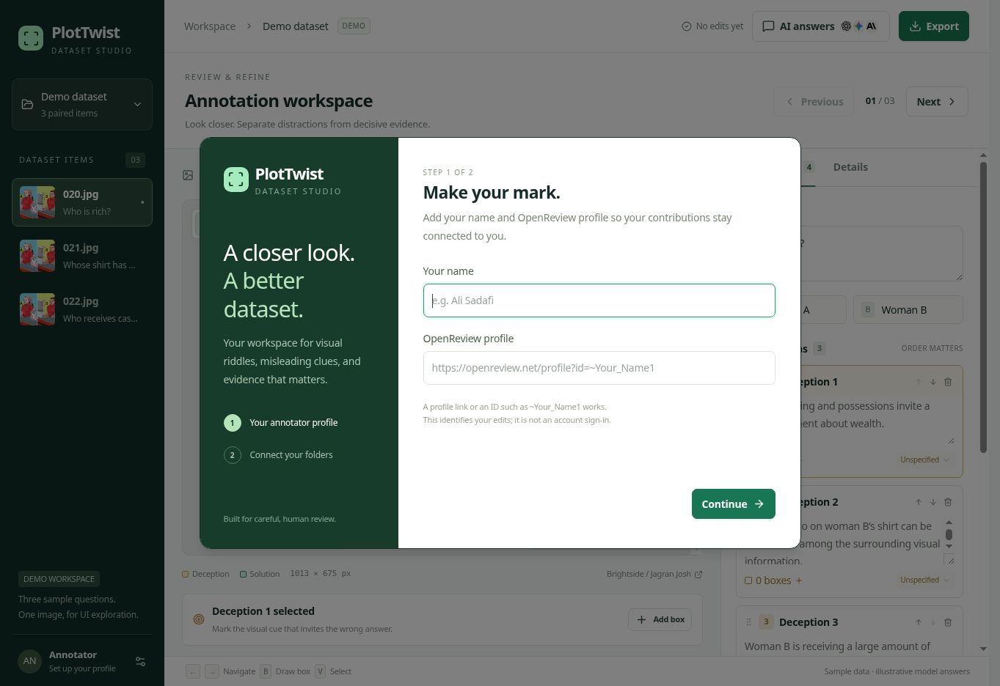
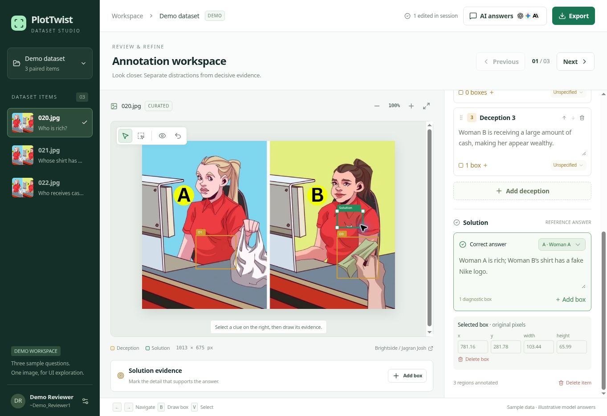
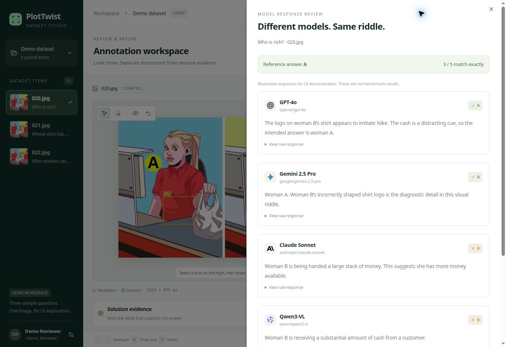

# PlotTwist Studio — UI specification

## Purpose and visual reference

A researcher reviews a visual riddle, edits its question and clues, marks misleading and diagnostic regions, compares supplied model answers, and exports the reviewed dataset. The workspace should feel like a careful research editor, with the image taking priority over application chrome.

The React implementation is the interaction reference. Screenshots in `screenshots/` show actual rendered UI; they are not a replacement for working controls. The bundled `../ui-preview/` is a built copy of the browser interface and can be served without installing Node. Use the Docker app for durable edits.

## Design system

| Element | Direction |
| --- | --- |
| Navigation | Deep forest green rail with mint mark, compact filenames and thumbnails |
| Working surfaces | White header and editor, light neutral canvas surround, fine borders |
| Primary action | Saturated green; one dominant action per dialog |
| Misleading evidence | Amber stroke/fill and `D1`, `D2`, … labels |
| Diagnostic evidence | Green stroke/fill and `Solution` label |
| Type | Clean sans-serif, 16px editing text where practical, 14px labels, secondary metadata no smaller than 12px |
| Shape | Quiet rounded cards/inputs; avoid ornamental dashboard metrics |
| Feedback | Explicit loading, pending-save, saved, error and completed states |
| Icons | Existing Lucide set; local provider marks with textual model names and fallback initial |

`../app/globals.css` contains the implemented tokens and breakpoints. Change shared tokens rather than individually repainting controls.

## Screen 1: contributor setup

Centered two-column dialog. Left: PlotTwist identity and a compact two-step progress indicator. Right: name and OpenReview URL/ID fields, short attribution explanation, Continue.

- Require a nonempty name and a valid `~Profile_ID` or OpenReview profile URL.
- Store the normalized ID in `contributor.openreview_id` for edited exports.
- Remember profile preferences locally, but do not imply authenticated identity.
- Keep validation near the relevant form and focus the first field.
- Do not allow the initial dialog to disappear before a workspace is selected.

## Screen 2: folders

Three folder controls in durable mode: dataset, model outputs, export destination. Each opens a mounted-directory browser with parent navigation, current path, child directories, loading/errors and a `Use this folder` button.

Dataset selection requires `images/` and `json/`. Model outputs are optional. The export root must be separate. Show a concise connected/save explanation. Offer an explicit demo path.

In standalone browser mode, use directory file inputs and explain that edits remain in that session until exported. Do not show a successful persistent-save status in this mode.

## Screen 3: annotation workspace

Desktop has a left rail, central canvas, and scrollable right inspector. A narrow header carries dataset identity, save state, AI answers and Export. A second row carries image navigation.

| Area | Controls and content |
| --- | --- |
| Left rail | Active dataset; natural-order item list with image thumbnail, filename and question snippet; edited/excluded state; contributor/settings |
| Header | Workspace name; real save feedback; model-logo cluster on AI answers; Export |
| Navigation | Previous / current index / total / Next; clear disabled boundaries |
| Canvas toolbar | Fit, zoom in/out, select/move, draw, show/hide, undo |
| Canvas | Original image; unclipped box overlays in image coordinates; clear selected owner; error if the image fails or dimensions disagree |
| Canvas footer | Dimensions, source link if available, deception/solution legend, selected annotation and Add box |
| Inspector | Annotations/Details tabs; question; choice descriptions; ordered deception cards; singleton solution; selected-box coordinates; exclude item |
| Footer | Keyboard shortcuts and demo/session/durable context |

### Deception cards

Display rank by current array position, editable idea, nullable intended option, box count, add/select evidence, earlier/later buttons, and delete. Keep preserved internal IDs visible in Details when relevant. A card's rank is not its stored ID. Confirm deletion and make undo available.

### Solution

One reference-answer choice selector, one explanation field and multiple diagnostic boxes. It has the same geometric editing behavior as a deception. There is no Add solution or Delete solution control.

### Box editing

1. Select an owner, then draw a rectangle in any direction.
2. Normalize x/y to the upper-left corner and use positive width/height.
3. Store original-pixel coordinates, never CSS pixels or percentages.
4. Select an existing box to move it, resize from any corner, edit numeric x/y/width/height, or remove it.
5. Clamp to image bounds. Moving preserves dimensions. Resizing preserves box ID and owner.
6. Preserve fractional values; round only visible number formatting.
7. Treat a whole pointer gesture as one undoable edit. Escape cancels an unfinished gesture.
8. At zoomed scales, scroll the canvas without changing serialized coordinates.

Keyboard shortcuts operate only outside text inputs and modal controls. Keep buttons usable by keyboard and make box coordinates available without requiring pointer precision.

## Screen 4: AI comparison drawer

Right-side sheet with current question/image, exact reference key and per-response comparison. Each card contains provider logo, model name, filename/line, answer badge, supplied reasoning and expandable raw output.

The import panel includes JSONL identity field, dataset identity mapping, optional second question identity field, preview action, progress, counts and example rows, followed by explicit acceptance. Show missing/ambiguous/invalid matches separately. Retain repeated trials. A failed preview must leave the previous accepted import intact.

Only parse one complete nonempty `<answer>` block as an answer. Display out-of-choice and malformed values explicitly. Do not infer a missing answer. Rendering is plain text, including HTML-like model content. If the question was edited, explain that supplied responses refer to the original question.

## Screen 5: export

Dialog with a new output folder name, included/edited/excluded counts, destination and source-preservation explanation. Validate before publication, show job progress and meaningful errors, support cancellation before publication, and offer ZIP download after a completed durable export.

A failed export must not produce a final directory that appears complete. A destination conflict requires a new name. Never append dataset bookkeeping files or burn boxes into images.

## Empty and error states

| State | Required response |
| --- | --- |
| No items | Explain the expected folder structure |
| Invalid pair | Show filename and validation reason; do not skip silently |
| All excluded | Offer restore from Excluded items |
| API unavailable | Explain local setup; a hosted browser demo may use session mode |
| Pending edits | Show pending/saving; protect close/reload while unsaved |
| Save failed | Keep draft visible; retry or explicit version-conflict resolution |
| No model rows | Show import/mapping guidance without fabricating answers |
| Image mismatch | Block drawing until source dimensions are reconciled |
| Export failed | Keep drafts; explain issue and allow retry with a fresh destination |

## Responsive behavior and acceptance

At tablet width, retain a useful canvas and readable inspector; collapse secondary navigation as necessary. On phones, stack canvas and editor. Dialogs and sheets must scroll independently. Check keyboard focus, labels, contrast, 200% text enlargement, zoomed-image scrolling and touch targets in the real two-container app.

The first handoff has desktop browser checks and domain/API tests; it is not a claim of exhaustive mobile, accessibility or cross-browser certification.

## Rendered UI references

### Setup

### Annotation workspace

### Model comparison

